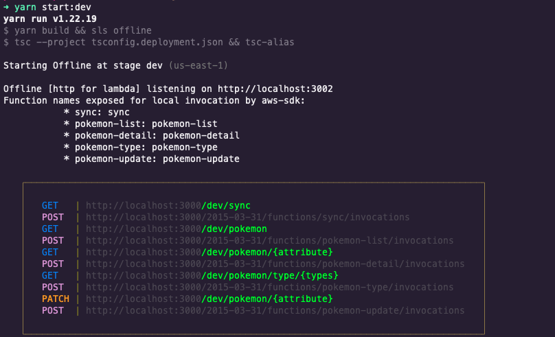

# Pokemon Api Challengue
    Backend from pokeApi, The goal is to connect to the pokeApi to this backend app and return all the details related to the pokemon synched.

# PokeApi URL
    https://pokeapi.co/api/v2
**Free api, no need of any kind of auth** 🧨

# Run Locally
If you want to setup locally this server, you need the following.

    - Nodejs (V14.x)
    - yarn (v1.x)
    - Mongo database
    - A Client to test it

Create a JSON file with the keys from env.example and fill out with your own; Example:
```
{
    "NODE_ENV": "develop",
    "DB_URI": "yourUri",
    "POKE_API_BASE_URL": "https://pokeapi.co/api/v2"
}
```
Then run the following commands:

    - yarn
    - yarn start:dev

It will be displayed a details from endpoints available to test it locally as the following



# Postman Collection
This URL you need to import it and will have a production requests.

    https://www.getpostman.com/collections/6af3c72c3f25f10aa3c9

Live URL: ```https://kjx29ldsj1.execute-api.us-east-1.amazonaws.com/dev/api```

**Each request will have an example and if apply a description** 🧨

# User stories & endpoints

## ```/sync``` GET
```
As a guest user,
So I can list all recently pokemon,
I would like to be able get sync with the pokeApi
```

## ```/pokemon``` GET
```
As a guest user,
So I can list all pokemon synched,
I would like to be able to list them
```

## ```/pokemon/{id / name}``` GET
```
As a guest user,
So I can get a pokemon,
I would like to be able to get it by name or by ID
```

## ```/pokemon/{id}``` PATCH
```
As a guest user,
So I can set a custom update to a specific pokemon,
I would like to be able to patch it
```

## ```/pokemon/type/{types}``` GET
```
As a guest user,
So I can get a specific list of pokemon,
I would like to be able to get them by type
```

# Technologies

```
- Hexagonal Arch
- Aws lambda with api-gateway with serverless for deployment
- Node, typescript
- JSON
- Mongo DB
- Git / Github
- ESlint
```